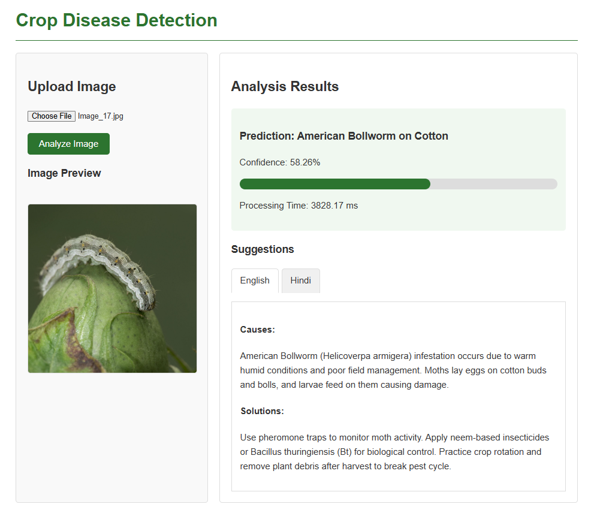

# Crop Disease Detection

## Overview

This project implements a deep learning-based solution for detecting diseases in crops through image analysis. It aims to help farmers and agricultural experts identify plant diseases early for timely intervention and treatment, potentially saving crops and increasing agricultural yield.

## Problem Statement

Crop diseases result in significant agricultural losses worldwide, with estimates suggesting 20-40% of global crop production is lost to pests and diseases annually. Early detection is crucial but traditionally relies on expert visual inspection, which is subjective, time-consuming, and often unavailable to farmers in remote areas.

## Solution Architecture

The solution consists of three main components:

1. **Deep Learning Model**: An EfficientNet-B2 neural network trained on a diverse dataset of crop disease images
2. **FastAPI Backend**: Handles image processing and model inference
3. **User Interface**: A web interface for image upload and disease diagnosis

## Features

- Detection of 42 different crop diseases and healthy crops across multiple plant types
- Bilingual disease information and treatment suggestions (English and Hindi)
- High-accuracy classification (95%+ on test data)
- Real-time image analysis with confidence scores
- Detailed treatment recommendations specific to each disease

## Technologies Used

- **Deep Learning**: PyTorch for model training and inference
- **Backend**: FastAPI for the API server
- **Model Architecture**: EfficientNet-B2 (transfer learning)
- **Image Processing**: PIL, OpenCV, TorchVision
- **Frontend**: HTML, CSS, JavaScript

## Dataset

The model was trained on a dataset of 20,000+ images containing:

- Multiple crop types: Cotton, Wheat, Rice, Maize, Sugarcane
- Various disease categories: Rust, Blight, Rot, Smut, Spot, Mildew, etc.
- Pest infestations: Bollworm, Aphid, Whitefly, Thrips, etc.
- Healthy plant examples for comparison

The training dataset was sourced from [Kaggle's 20k Multi-class Crop Disease Images](https://www.kaggle.com/datasets/jawadali1045/20k-multi-class-crop-disease-images).

## Installation

### Prerequisites

- Python 3.7+
- PyTorch 1.8+
- FastAPI
- Uvicorn

### Setup

1. Clone the repository

   ```bash
   git clone https://github.com/your-username/crop-disease-detection.git
   cd crop-disease-detection
   ```

2. Create a virtual environment

   ```bash
   python -m venv venv
   source venv/bin/activate  # On Windows: venv\Scripts\activate
   ```

3. Install dependencies

   ```bash
   pip install -r requirements.txt
   ```

4. Download the pre-trained model
   ```bash
   # Place the model in the model/ directory
   mkdir -p model
   # Download from your storage location
   ```

## Usage

### Running the API Server

```bash
uvicorn main:app --reload --host 0.0.0.0 --port 8000
```

### Using the Web Interface

1. Open `ui/testCrop.html` in a web browser
2. Upload an image of the crop you want to analyze
3. Click "Analyze Image"
4. View the results including:
   - Disease classification
   - Confidence score
   - Causes of the disease
   - Recommended treatment solutions (in English and Hindi)

### Example Prediction

Below is an example of a successful prediction:



### API Endpoints

- `GET /`: API health check
- `POST /predict/`: Predict disease from a single image
- `POST /predict/batch/`: Predict diseases for multiple images (max 10)

## Model Architecture

The disease detection system uses EfficientNet-B2, a convolutional neural network known for its efficiency:

- Transfer learning from pre-trained ImageNet weights
- Input size: 224×224 RGB images
- Custom classifier head with dropout (0.3) for regularization
- Output: 42 disease classes

## Performance

- Accuracy: ~95% on test dataset
- Average inference time: <100ms per image
- Model size: Optimized with TorchScript for deployment

## Future Improvements

- Mobile application for offline, in-field disease detection
- Integration with weather data for predictive disease forecasting
- Adding more regional languages for wider accessibility
- Expanding the model to cover more crop varieties and diseases
- Implementing severity grading for detected diseases

## Contributing

Contributions to improve the project are welcome! Please follow these steps:

1. Fork the repository
2. Create a new branch (`git checkout -b feature-branch`)
3. Make your changes
4. Commit your changes (`git commit -m 'Add feature'`)
5. Push to the branch (`git push origin feature-branch`)
6. Create a new Pull Request

## License

This project is licensed under the MIT License - see the LICENSE file for details.

## Acknowledgments

- The dataset providers for making training data available
- The open source community for the tools and libraries used
- Agricultural experts who contributed to the disease treatment suggestions
